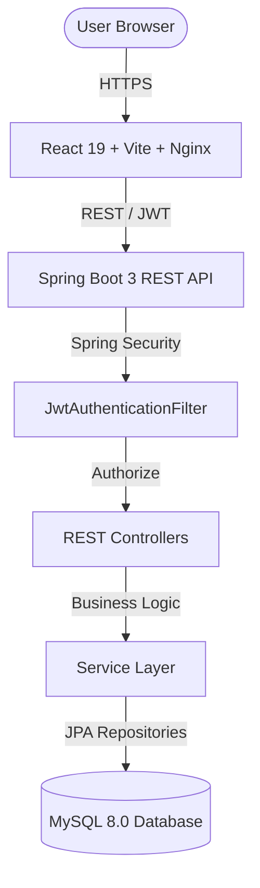
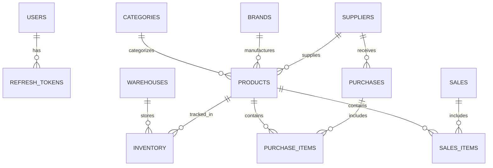

# StockFlow — Enterprise Inventory & Supply Chain Management System

StockFlow is a production-grade, full-stack Inventory, Procurement, and Sales Order Management system engineered with **Spring Boot 3 (Java 17)**, **React 19**, **Vite**, **Tailwind CSS**, and **MySQL 8.0**.

---

## Key Features

- **JWT Authentication & RBAC**: Secure stateless authentication supporting `ADMIN`, `MANAGER`, and `STAFF` roles.
- **Master Data Management**: Full CRUD for Categories, Brands, Suppliers, and Multi-Warehouse storage locations.
- **Product Catalog Management**: SKU generation, price tracking, category/brand classification, low stock thresholds, and stock allocation.
- **Inventory & Movement Tracking**: Multi-warehouse stock level tracking, stock movements (`IN`, `OUT`, `ADJUSTMENT`), and automatic stock state updates.
- **Procurement (Purchase Management)**: Purchase order creation with dynamic itemized line items, supplier allocation, and status lifecycle (`DRAFT`, `PENDING`, `RECEIVED`, `CANCELLED`).
- **Sales Order Management**: Stock-validated sales order fulfillment, real-time stock deduction, unit pricing, and status management (`DRAFT`, `CONFIRMED`, `SHIPPED`, `DELIVERED`, `CANCELLED`).
- **Executive Dashboard**:
  - **11 Real-Time Financial & Operational KPIs**: Total Revenue, Purchase Cost, Inventory Valuation, Gross Profit, Total Products, Total Suppliers, Total Warehouses, Total Sales, Total Purchases, Low Stock Items, Out of Stock Items.
  - **4 Analytics Charts**: Monthly Revenue Timeline (Area), Monthly Purchases (Bar), Category Valuation (Donut), Warehouse Distribution (Bar).
  - **5 Dashboard Widgets**: Top Products, Top Suppliers, Low Stock Alert Table, Recent Purchases, Recent Sales.
- **Enterprise Reports & Multi-Format Export**: PDF, Excel (`.xlsx`), and CSV downloads for Financial Summaries, Inventory Audits, Sales Histories, and Purchase Statements.
- **Global Keyboard Search (`Ctrl + K`)**: Modal search index across Products, Suppliers, Categories, Brands, Warehouses, Purchases, and Sales.
- **Notification Center**: Real-time stock alerts for low-stock and out-of-stock thresholds.
- **Role-Based Settings & Dark Mode**: Persistent theme switching (Dark/Light mode) and profile management.

---

## Tech Stack

### Backend
* **Language/Framework**: Java 17, Spring Boot 3.2.x
* **Security**: Spring Security 6, JWT (JSON Web Tokens)
* **ORM / Database**: Spring Data JPA, Hibernate, MySQL 8.0
* **API Documentation**: OpenAPI 3.0 / Swagger UI (`springdoc-openapi`)
* **Build Tool**: Apache Maven

### Frontend
* **Core Framework**: React 19, Vite
* **Styling**: Tailwind CSS v4, Lucide Icons, Glassmorphism UX
* **State Management**: Zustand (Auth & Theme state)
* **Server State / Caching**: TanStack React Query v5
* **Form & Validation**: React Hook Form, Zod
* **Charts**: Recharts

---

## System Architecture



---

## Database Design



---

## Local Development Setup

### Prerequisites
* Java JDK 17+
* Node.js v20+
* MySQL 8.0 Server running on port 3306

### 1. Database Setup
Create database in MySQL:
```sql
CREATE DATABASE stockflow_db;
```

### 2. Backend Setup
```bash
cd stockflow-backend
# Copy environment variables template
cp .env.example .env

# Run Spring Boot app
./mvnw spring-boot:run
```
Backend API will start at: `http://localhost:8080/api`  
Swagger API Documentation: `http://localhost:8080/api/swagger-ui.html`

### 3. Frontend Setup
```bash
cd stockflow-frontend
# Install dependencies
npm install

# Copy environment template
cp .env.example .env.local

# Run Vite dev server
npm run dev
```
Frontend app will be available at: `http://localhost:5173`

---

## Docker Setup

Orchestrate the entire application (MySQL 8.0, Spring Boot Backend, Nginx Frontend) with one command:

```bash
# Copy root environment variables
cp .env.example .env

# Build and spin up containers
docker compose up -d --build
```

Access points:
- **Frontend App**: `http://localhost` (Port 80)
- **Backend API**: `http://localhost:8080/api`
- **Swagger Docs**: `http://localhost:8080/api/swagger-ui.html`

To stop containers:
```bash
docker compose down -v
```

---

## Deployment Guide

### Backend (Railway / Render)
1. Link GitHub repository to Railway or Render.
2. Set Environment Variables:
   - `SPRING_DATASOURCE_URL`: `jdbc:mysql://<host>:<port>/<dbname>`
   - `SPRING_DATASOURCE_USERNAME`: `<db_user>`
   - `SPRING_DATASOURCE_PASSWORD`: `<db_password>`
   - `JWT_SECRET`: `<secure_256bit_key>`
3. Set build command: `./mvnw clean package -DskipTests`
4. Start command: `java -jar target/*.jar`

### Frontend (Vercel)
1. Import `stockflow-frontend` project into Vercel.
2. Framework Preset: **Vite**.
3. Set Environment Variable:
   - `VITE_API_BASE_URL`: `https://<your-backend-domain>/api`
4. Deploy using root configuration or included `vercel.json`.

---

## Resume & Interview Bullet Points

- **Architectural Design**: Designed and built a modular supply chain management system handling inventory stock movements across multi-warehouse environments with Spring Boot 3 & React 19.
- **Stateless Authentication**: Implemented JWT authentication with Spring Security 6, custom filter chains, role-based authorization (`ADMIN`, `MANAGER`, `STAFF`), and token expiration management.
- **Optimized Data Pipeline**: Engineered reactive dashboards with 11 KPIs and 4 Recharts visualizations, leveraging TanStack React Query for background caching, optimistic invalidations, and 5-minute stale-time strategies.
- **Enterprise Reporting Engine**: Integrated PDF (iText), Excel (Apache POI), and CSV export services delivering automated audit downloads with dynamic binary blob streams.
- **Containerization**: Configured multi-stage Docker builds and Docker Compose orchestration for MySQL 8.0, Spring Boot runtime, and Nginx reverse proxies.

---

## License

This project is licensed under the [MIT License](LICENSE).
